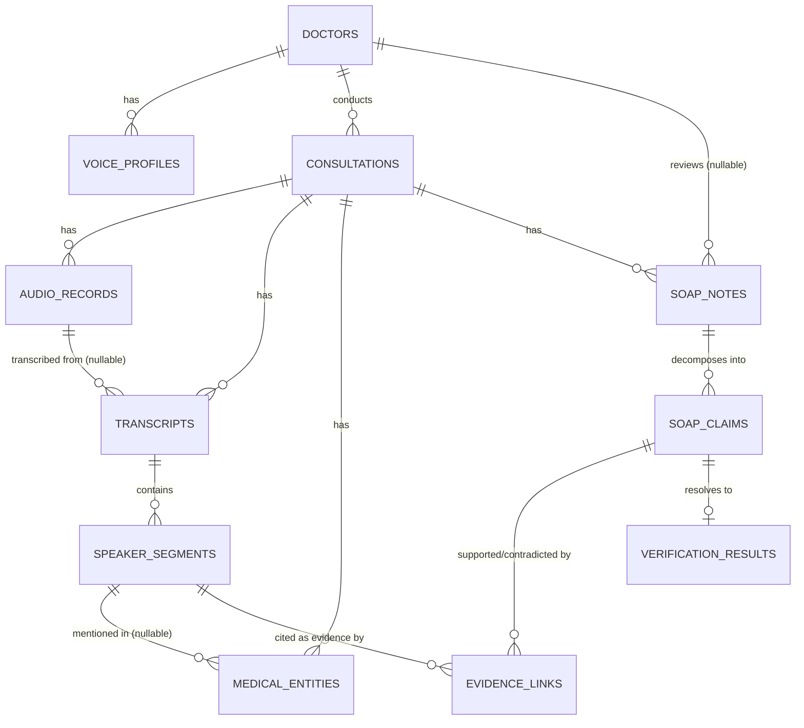

# Database Design

Status: Design proposal only. No tables, migrations, or ORM models exist yet.

## 1. Database Purpose

MediScribeAI converts multilingual Tamil-English doctor-patient consultations into
structured SOAP notes, and verifies each generated clinical claim against the source
transcript using an evidence-linked hallucination detection mechanism.

The schema exists to:

- Persist the consultation lifecycle: audio → transcript → speaker segments →
  extracted medical entities → generated SOAP note.
- Represent the research-critical link between a **SOAP claim** and the exact
  **transcript evidence** that supports, contradicts, or fails to support it.
- Preserve a doctor-in-the-loop review workflow (generated → edited → approved /
  rejected) so the doctor always has final authority over the clinical record.
- Avoid storing large binary/raw text redundantly — audio stays on external
  storage, and evidence links reference existing transcript segments rather than
  copying transcript text.

Target engine: **PostgreSQL 16**. ORM: **SQLAlchemy** (introduced in a later step —
not used here).

## 2. Entity List

Ten core entities were specified for this step. A single supporting table,
`soap_claims`, is added beneath `soap_notes` because the evidence-linking
requirement is explicitly stated at claim/statement granularity ("one generated
SOAP statement to reference one or more transcript segments"), not at whole-note
granularity. Without decomposing a SOAP note into individual claims, evidence
links would have nothing precise to attach to. It is not a new top-level concept —
it is the atomic unit that `soap_notes` is made of.

| # | Entity | Table name |
|---|--------|------------|
| 1 | Doctor | `doctors` |
| 2 | Voice Profile | `voice_profiles` |
| 3 | Consultation | `consultations` |
| 4 | Audio Record | `audio_records` |
| 5 | Transcript | `transcripts` |
| 6 | Speaker Segment | `speaker_segments` |
| 7 | Medical Entity | `medical_entities` |
| 8 | SOAP Note | `soap_notes` |
| 8a | SOAP Claim *(supporting)* | `soap_claims` |
| 9 | Evidence Link | `evidence_links` |
| 10 | Verification Result | `verification_results` |

Patients are intentionally **not** modeled as a separate entity in this step —
that was not in the requested scope. Minimal patient context lives directly on
`consultations` as plain fields (see §4.3). A dedicated `patients` table is noted
as a future extension in §9.

## 3. Relationship Diagram



Notes on cardinality choices:

- `consultations → audio_records` / `transcripts` / `soap_notes` are one-to-many
  rather than one-to-one to allow re-recording and note versioning without
  destructive overwrites. The "current" one is identified by a flag/status, not by
  deleting prior rows.
- `soap_claims → verification_results` is one-to-one: each claim resolves to
  exactly one current verification outcome, but a claim can have many
  `evidence_links` (one per matched transcript segment) feeding into that single
  result.

## 4. Table-by-Table Schema Proposal

All primary keys use `UUID DEFAULT gen_random_uuid()` (pgcrypto's `gen_random_uuid()`
is built into PostgreSQL 16) for consistency across every table and to keep IDs
safe to reference across future distributed fog-node components without
collision. All tables include `created_at TIMESTAMPTZ DEFAULT now()`; tables that
are mutated after creation also include `updated_at`.

### 4.1 `doctors`

| Column | Type | Nullable | Notes |
|---|---|---|---|
| id | UUID | NO | PK |
| full_name | TEXT | NO | |
| email | TEXT | NO | UNIQUE |
| specialization | TEXT | YES | |
| created_at | TIMESTAMPTZ | NO | default `now()` |

### 4.2 `voice_profiles`

Optional per-doctor voice reference to assist future speaker diarization
(distinguishing doctor vs. patient audio). Stores a reference/embedding pointer,
not raw audio.

| Column | Type | Nullable | Notes |
|---|---|---|---|
| id | UUID | NO | PK |
| doctor_id | UUID | NO | FK → `doctors.id` |
| embedding_reference | TEXT | NO | path/URI to stored voice embedding artifact |
| created_at | TIMESTAMPTZ | NO | default `now()` |

Relationship: one doctor may have multiple voice profiles over time (re-enrollment);
`doctor_id` is indexed.

### 4.3 `consultations`

Represents a single doctor-patient interaction and is the hub the rest of the
pipeline hangs off of.

| Column | Type | Nullable | Notes |
|---|---|---|---|
| id | UUID | NO | PK |
| doctor_id | UUID | NO | FK → `doctors.id` |
| patient_reference | TEXT | YES | free-text/external identifier only; no dedicated patient table yet |
| consultation_date | TIMESTAMPTZ | NO | when the consultation took place |
| language_mode | TEXT | YES | e.g. `ta`, `en`, `ta+en` — informational, no enum lock-in yet |
| status | TEXT | NO | `scheduled` \| `in_progress` \| `completed` \| `reviewed`; default `scheduled` |
| created_at | TIMESTAMPTZ | NO | default `now()` |
| updated_at | TIMESTAMPTZ | NO | default `now()`, updated on change |

Indexes: `doctor_id`, `status`, `consultation_date`.

### 4.4 `audio_records`

Metadata and storage reference only — **no binary audio in PostgreSQL**.

| Column | Type | Nullable | Notes |
|---|---|---|---|
| id | UUID | NO | PK |
| consultation_id | UUID | NO | FK → `consultations.id` |
| storage_path | TEXT | NO | filesystem/object-storage path or URI |
| format | TEXT | YES | e.g. `wav`, `mp3` |
| duration_seconds | NUMERIC | YES | |
| sample_rate_hz | INTEGER | YES | |
| file_size_bytes | BIGINT | YES | |
| checksum | TEXT | YES | integrity verification |
| recorded_at | TIMESTAMPTZ | YES | |
| created_at | TIMESTAMPTZ | NO | default `now()` |

Indexes: `consultation_id`.

### 4.5 `transcripts`

| Column | Type | Nullable | Notes |
|---|---|---|---|
| id | UUID | NO | PK |
| consultation_id | UUID | NO | FK → `consultations.id` |
| audio_record_id | UUID | YES | FK → `audio_records.id`; which audio produced this transcript |
| full_text | TEXT | NO | complete transcript text |
| asr_model | TEXT | YES | metadata: model/version used |
| is_final | BOOLEAN | NO | default `false`; marks the transcript version currently used downstream |
| created_at | TIMESTAMPTZ | NO | default `now()` |

Indexes: `consultation_id`, partial index on `(consultation_id) WHERE is_final = true`.

### 4.6 `speaker_segments`

Diarization output is not assumed to be perfectly Doctor/Patient-labeled, so the
raw speaker label and an (optional, correctable) inferred role are kept separate.

| Column | Type | Nullable | Notes |
|---|---|---|---|
| id | UUID | NO | PK |
| transcript_id | UUID | NO | FK → `transcripts.id` |
| sequence_index | INTEGER | NO | ordering within the transcript |
| speaker_label | TEXT | NO | raw diarization label, e.g. `SPEAKER_00` |
| inferred_role | TEXT | YES | `doctor` \| `patient` \| `unknown`; nullable, correctable |
| start_time_ms | INTEGER | NO | |
| end_time_ms | INTEGER | NO | |
| segment_text | TEXT | NO | transcript text for this segment |
| diarization_confidence | NUMERIC | YES | |
| created_at | TIMESTAMPTZ | NO | default `now()` |

Indexes: `(transcript_id, sequence_index)` — this is the primary access pattern
(read a transcript's segments in order).

### 4.7 `medical_entities`

No ontology or coding system (ICD-10 etc.) yet — entities are stored as
extracted spans with a simple type tag.

| Column | Type | Nullable | Notes |
|---|---|---|---|
| id | UUID | NO | PK |
| consultation_id | UUID | NO | FK → `consultations.id`; denormalized for direct consultation-level queries |
| speaker_segment_id | UUID | YES | FK → `speaker_segments.id`; segment the entity was extracted from |
| entity_type | TEXT | NO | `symptom` \| `medication` \| `dosage` \| `allergy` \| `diagnosis` \| `vital` \| `medical_history` |
| entity_text | TEXT | NO | raw extracted span |
| normalized_value | TEXT | YES | reserved for future normalization (e.g. dosage → numeric + unit) |
| start_char | INTEGER | YES | offset into `segment_text`, for evidence tracing |
| end_char | INTEGER | YES | |
| confidence_score | NUMERIC | YES | extraction model confidence |
| created_at | TIMESTAMPTZ | NO | default `now()` |

Indexes: `(consultation_id, entity_type)`, `speaker_segment_id`.

### 4.8 `soap_notes`

One row per generated/edited version of a consultation's SOAP note — versioned
rather than mutated in place, so prior generations remain auditable.

| Column | Type | Nullable | Notes |
|---|---|---|---|
| id | UUID | NO | PK |
| consultation_id | UUID | NO | FK → `consultations.id` |
| version | INTEGER | NO | monotonically increasing per consultation |
| subjective | TEXT | YES | |
| objective | TEXT | YES | |
| assessment | TEXT | YES | |
| plan | TEXT | YES | |
| status | TEXT | NO | `generated` \| `edited` \| `approved` \| `rejected`; default `generated` |
| generated_by | TEXT | YES | model/version that produced this note |
| reviewed_by_doctor_id | UUID | YES | FK → `doctors.id`; set on approval/rejection/edit |
| reviewed_at | TIMESTAMPTZ | YES | |
| created_at | TIMESTAMPTZ | NO | default `now()` |
| updated_at | TIMESTAMPTZ | NO | default `now()`, updated on change |

Constraints: `UNIQUE (consultation_id, version)`.
Indexes: `consultation_id`.

### 4.8a `soap_claims`

Decomposes a SOAP note into individually verifiable statements — the unit that
evidence linking and verification actually operate on.

| Column | Type | Nullable | Notes |
|---|---|---|---|
| id | UUID | NO | PK |
| soap_note_id | UUID | NO | FK → `soap_notes.id` |
| section | TEXT | NO | `subjective` \| `objective` \| `assessment` \| `plan` |
| claim_text | TEXT | NO | the individual generated statement |
| sequence_index | INTEGER | NO | ordering within the section |
| created_at | TIMESTAMPTZ | NO | default `now()` |

Indexes: `soap_note_id`.

### 4.9 `evidence_links` (research-critical)

Connects one SOAP claim to one piece of transcript evidence. A single claim may
have multiple rows here (multiple supporting/contradicting segments).

| Column | Type | Nullable | Notes |
|---|---|---|---|
| id | UUID | NO | PK |
| soap_claim_id | UUID | NO | FK → `soap_claims.id` |
| speaker_segment_id | UUID | NO | FK → `speaker_segments.id`; the evidence source — no transcript text is duplicated here |
| relationship_type | TEXT | NO | `supports` \| `contradicts` \| `insufficient` |
| alignment_score | NUMERIC | YES | similarity/entailment score between claim and segment |
| evidence_snippet | TEXT | YES | optional short cached excerpt for display convenience only; source of truth remains `speaker_segments.segment_text` |
| created_at | TIMESTAMPTZ | NO | default `now()` |

Indexes: `soap_claim_id`, `speaker_segment_id`.

### 4.10 `verification_results`

The aggregated, current verification outcome for a claim, derived from its
`evidence_links`.

| Column | Type | Nullable | Notes |
|---|---|---|---|
| id | UUID | NO | PK |
| soap_claim_id | UUID | NO | FK → `soap_claims.id`; UNIQUE |
| status | TEXT | NO | `supported` \| `unsupported` \| `contradicted` \| `uncertain` |
| confidence_score | NUMERIC | NO | |
| verifier_model | TEXT | YES | model/version that produced this verdict |
| verified_at | TIMESTAMPTZ | NO | default `now()` |

Constraints: `UNIQUE (soap_claim_id)` — one current result per claim.
Indexes: `soap_claim_id` (covered by the unique constraint), `status`.

## 5. Primary / Foreign Key Relationships (Summary)

```text
doctors.id            ←── voice_profiles.doctor_id
doctors.id            ←── consultations.doctor_id
doctors.id            ←── soap_notes.reviewed_by_doctor_id (nullable)

consultations.id      ←── audio_records.consultation_id
consultations.id      ←── transcripts.consultation_id
consultations.id      ←── medical_entities.consultation_id
consultations.id      ←── soap_notes.consultation_id

audio_records.id      ←── transcripts.audio_record_id (nullable)
transcripts.id         ←── speaker_segments.transcript_id
speaker_segments.id    ←── medical_entities.speaker_segment_id (nullable)
speaker_segments.id    ←── evidence_links.speaker_segment_id

soap_notes.id          ←── soap_claims.soap_note_id
soap_claims.id          ←── evidence_links.soap_claim_id
soap_claims.id          ←── verification_results.soap_claim_id (unique)
```

## 6. Evidence-Linking Design

This is the schema's research-critical path:

```text
soap_claims (one row per generated statement)
      │
      ├──> evidence_links (0..N rows: one per matched transcript segment)
      │        │
      │        └──> speaker_segments (existing evidence, not duplicated)
      │
      └──> verification_results (1 row: the aggregated current verdict)
```

Design rationale:

- **No transcript duplication.** `evidence_links` points to `speaker_segment_id`
  rather than copying transcript text. The optional `evidence_snippet` is a
  display cache only, not the source of truth.
- **Many-to-many via `evidence_links`.** A claim can cite multiple segments
  (e.g. a symptom mentioned across two turns), and in principle a segment can
  be cited as evidence for multiple claims — `evidence_links` is the join table
  that makes both directions possible.
- **Per-link judgement vs. aggregate judgement.** Each `evidence_links` row
  carries its own `relationship_type` (supports/contradicts/insufficient) for
  that specific piece of evidence; `verification_results` holds the single
  aggregated outcome for the claim as a whole (`supported` / `unsupported` /
  `contradicted` / `uncertain`), which is what downstream metrics read.
- **Metrics computability.** Because every claim has exactly one
  `verification_results` row with a `status` and `confidence_score`, and every
  result traces back to `evidence_links` and `soap_claims` → `soap_notes` →
  `consultations`, the following can all be computed without new tables:
  - Hallucination rate = `unsupported + contradicted` claims / total claims
    (per note, per doctor, or overall).
  - Support rate = `supported` claims / total claims.
  - Evidence coverage = claims with ≥1 `evidence_links` row / total claims.
  - Confidence distribution = aggregate over `verification_results.confidence_score`.

## 7. Doctor Review Workflow

Tracked on `soap_notes.status`:

```text
generated ──edit──> edited ──approve──> approved
    │                  │
    └────reject────────┴───────────────> rejected
```

- `generated`: system output, untouched by a doctor.
- `edited`: a doctor has modified subjective/objective/assessment/plan text.
- `approved`: doctor has signed off; this becomes the note of record for the
  consultation.
- `rejected`: doctor discarded this version (a new version may be generated).

Because `soap_notes` is versioned (`consultation_id` + `version`, not mutated in
place), an edit can either update the current draft row or insert a new version
— that choice is an implementation detail for the SQLAlchemy step, not fixed
here. `reviewed_by_doctor_id` and `reviewed_at` capture who acted and when.

## 8. Indexing Considerations

| Table | Index | Reason |
|---|---|---|
| `consultations` | `doctor_id` | doctor's consultation list |
| `consultations` | `status` | filtering in-progress/completed queues |
| `audio_records` | `consultation_id` | lookup by consultation |
| `transcripts` | `consultation_id`; partial `WHERE is_final` | fetch the active transcript fast |
| `speaker_segments` | `(transcript_id, sequence_index)` | ordered segment read — the hot path for transcript display and evidence lookup |
| `medical_entities` | `(consultation_id, entity_type)` | entity summaries per consultation |
| `soap_notes` | `consultation_id`; unique `(consultation_id, version)` | version lookup/integrity |
| `soap_claims` | `soap_note_id` | claim list per note |
| `evidence_links` | `soap_claim_id`, `speaker_segment_id` | both directions of the evidence join |
| `verification_results` | unique `soap_claim_id`; `status` | one-per-claim lookup and metric aggregation by status |

No indexes are proposed on large free-text columns (`full_text`, `segment_text`,
`claim_text`) at this stage — full-text search is out of scope for this step and
would be a deliberate future addition (e.g. `pg_trgm` or `tsvector`), not a
default index.

## 9. Future Extensibility Notes

Explicitly deferred, not designed here:

- **Dedicated `patients` table** — currently a plain text field on
  `consultations`; would need its own identity/privacy handling.
- **Medical ontology / coding** — `medical_entities.entity_type` is a flat
  string today; ICD-10/CPT/SNOMED mapping would be a separate lookup table
  joined in later, not a redesign of this table.
- **FHIR/HL7 export** — would be a translation layer reading from this schema,
  not a change to it.
- **Audio storage backend** — `audio_records.storage_path` is backend-agnostic
  (local disk today, object storage later) by design.
- **Multi-segment claim evidence weighting** — `evidence_links.alignment_score`
  is a single scalar per link; a more sophisticated aggregation function into
  `verification_results.confidence_score` can evolve without a schema change.
- **Fog-node distribution, caching (Redis), queues (RabbitMQ), multi-tenancy,
  billing, appointments** — out of scope per this step's instructions and not
  reflected anywhere in this design.
